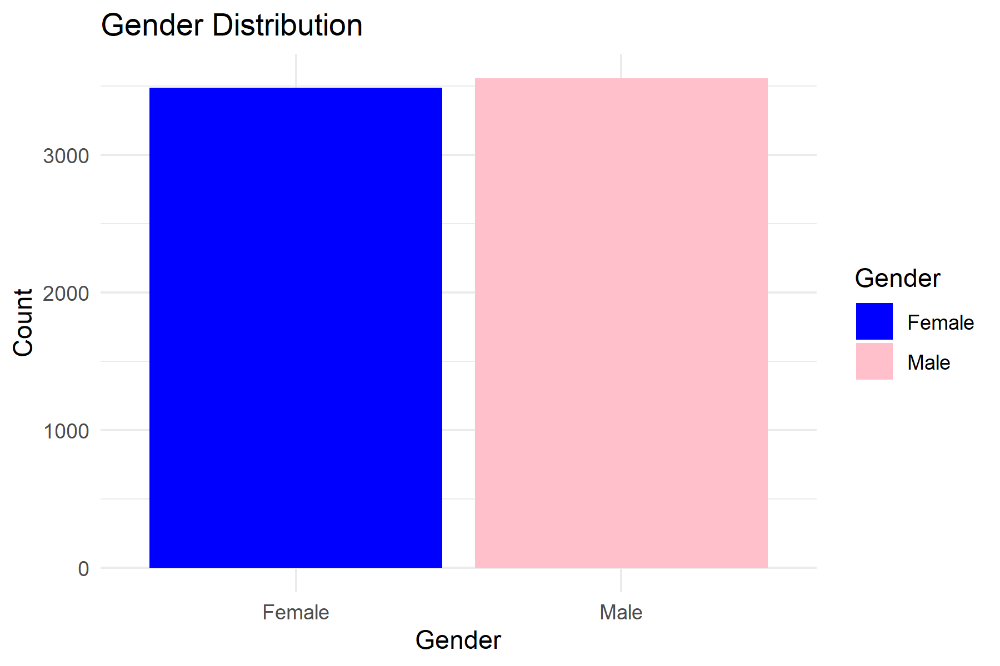
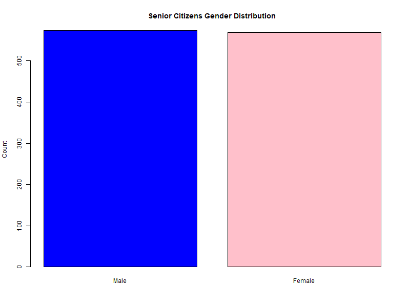
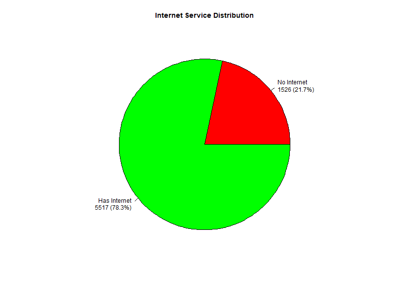
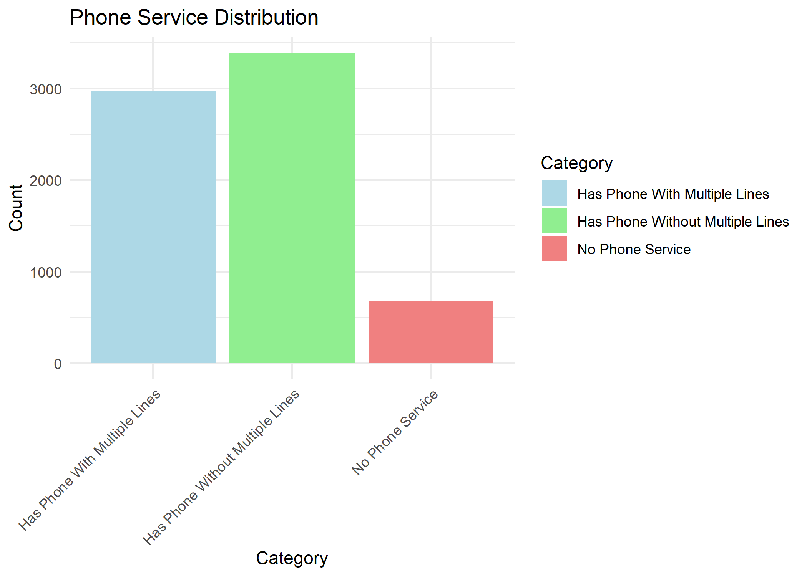
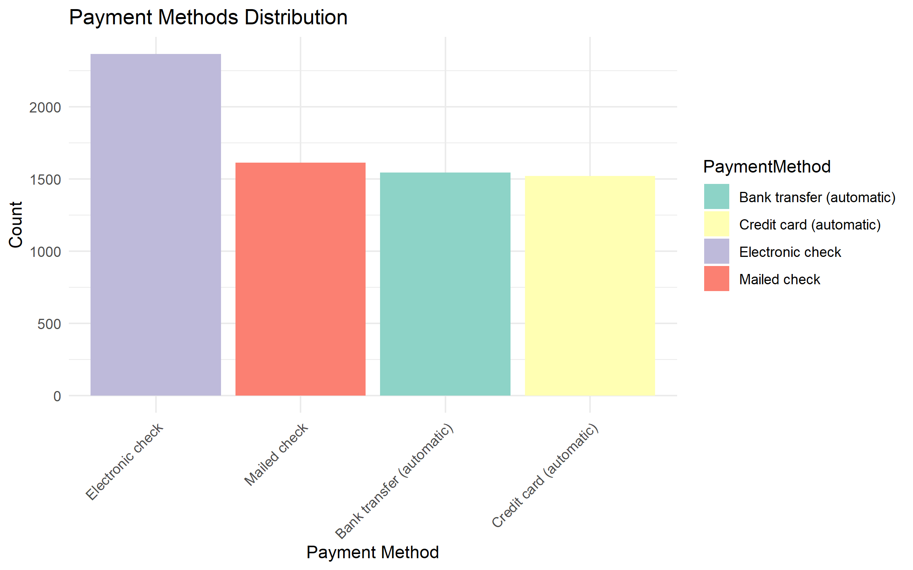
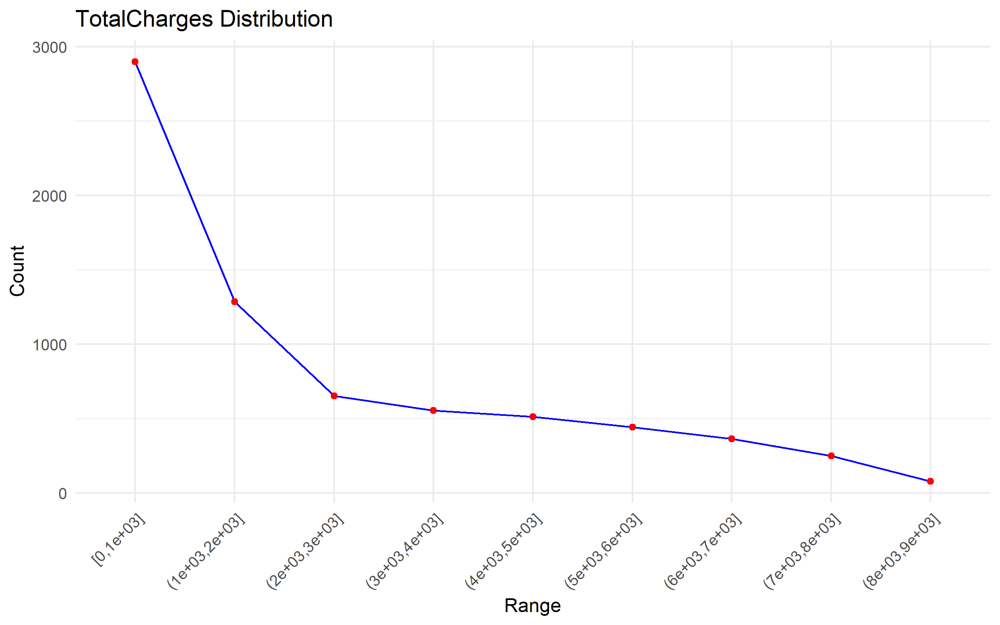

# Data Analysis Using R Programming - Customer Churn

## Project Overview
This project performs a comprehensive **data analysis** on a customer churn dataset using **R Programming**.  
It includes data cleaning, exploratory data analysis (EDA), and visualizations to uncover patterns and insights related to customer churn.

**Technologies & Packages Used:**
- R Programming  
- `ggplot2`  
- `dplyr`  
- `caret`  
- `missForest`  

---

## Features

### 1. Data Cleaning
- Imputation of missing values using `missForest`  
- Conversion of numeric and categorical variables  

### 2. Exploratory Data Analysis (EDA)
- Gender distribution  
- Senior citizen analysis  
- Internet and phone service analysis  
- Payment method analysis  
- Total charges distribution  

### 3. Visualizations
All plots are saved in the `outputs/` folder and embedded below for quick preview.

#### Gender Distribution


#### Senior Citizen Distribution by Gender


#### Internet Service Distribution


#### Phone Service Distribution


#### Payment Methods Distribution


#### Total Charges Distribution


#### Churn by Contract Type


---

## Outputs
- Cleaned dataset: `customerchurn_cleaned.csv`  
- All visualizations: saved in `outputs/` folder  

## File Structure
- `customer_churn1.csv`
- `customerchurn_cleaned.csv`
- `Mohantynaanee1.R`
- `README.md`
- `outputs/` (folder containing all generated graphs)

## How to Run
1. Open `Mohantynaanee1.R` in **RStudio**.
2. Install required packages if not already installed:
```R
install.packages(c("dplyr", "ggplot2", "caret", "missForest"))
